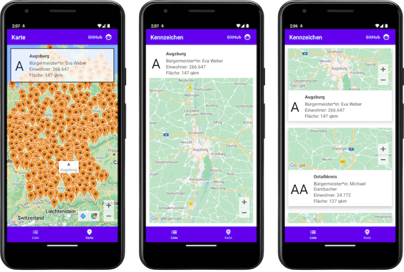

# kotlin-kmm-kennzeichner

## tl;dr
This is currently a playground to get to know with [Kotlin Mobile Multiplatform](https://kotlinlang.org/lp/mobile/) in combination with a shared Jetpack Compose and SwiftUI.

## Build status

|Service|Status|
|-------|------|
|-|-|

## Publications

- Dr. Windows: [Entwicklertagebuch: Kennzeichner #1 mit Bing AI Chat als Datengrundlage](https://www.drwindows.de/news/entwicklertagebuch-kennzeichner-1-mit-bing-ai-chat-als-datengrundlage)

## Versions

### 0.2 (Android MVP)
**Main features**

First Android views (List, detail, map) alongside the required `shared` features were implemented and tested.

**UI**

### 0.1 (Project setup)
**Main features**

Succesfull run of the Android Studio Kotlin Mobile Multiplatform. Tested by starting the Android and iOS application.

## Feature roadmap

### Setup
- [x] Project setup
- [x] Find data source of license plate ids

### Core functionality
- [x] List license plates id
- [x] Show detail of a license plate id

### UI
#### Android (Compose)
- [x] Create list view
- [x] Create detail view
- [x] Create map view with markers
- [ ] Add searchbar to filter lists
- [ ] Add Surface Duo's two pane support

#### iOS (SwiftUI)
- [ ] Create list view
- [ ] Create detail view
- [ ] Create map view with markers
- [ ] Add searchbar to filter lists

### Future feature ideas
- [ ] Add digital assistant support

### Instruments
- [ ] Check how's the memory consumption
- [ ] Check if there is no memory leakage

## Keep in mind
This app is purely build for having fun! All features have room for improvements or could be done more elegant. This app was and will be never meant to run in production-like environments. Learning is fun!

## Authors
Just me, [Tobi]([https://tscholze.github.io).

## Links
- [Dr. Windows](https://drwindows.de) news portal and community.
- [Kobweb Discord](https://discord.com/invite/5NZ2GKV5Cs) server where I met awesome Kotlin folks
- [KMM product page](https://kotlinlang.org/lp/mobile/) at kotlinlang.org

## Thanks to
The app is built on the work of giants. Without the following folks, repositories and posts, my tiny project would not exist.

- [David Herman (bitspittle)](https://github.com/bitspittle) - one of the most aspiring Kotlin educator and developer of [Kobweb](http://kobweb.varabyte.com)
- [Adrian Witaszak (adrianwitaszak)](https://github.com/adrianwitaszak) for bringing the joy of KMM into my life

## License
This project is licensed under the MIT License - see the [LICENSE](LICENSE) file for details.
Dependencies or assets maybe licensed differently.
