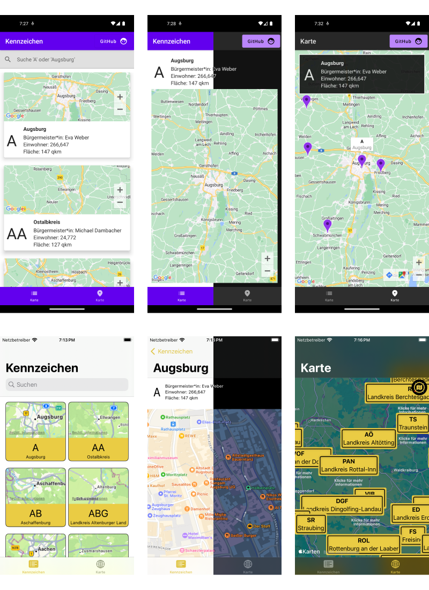
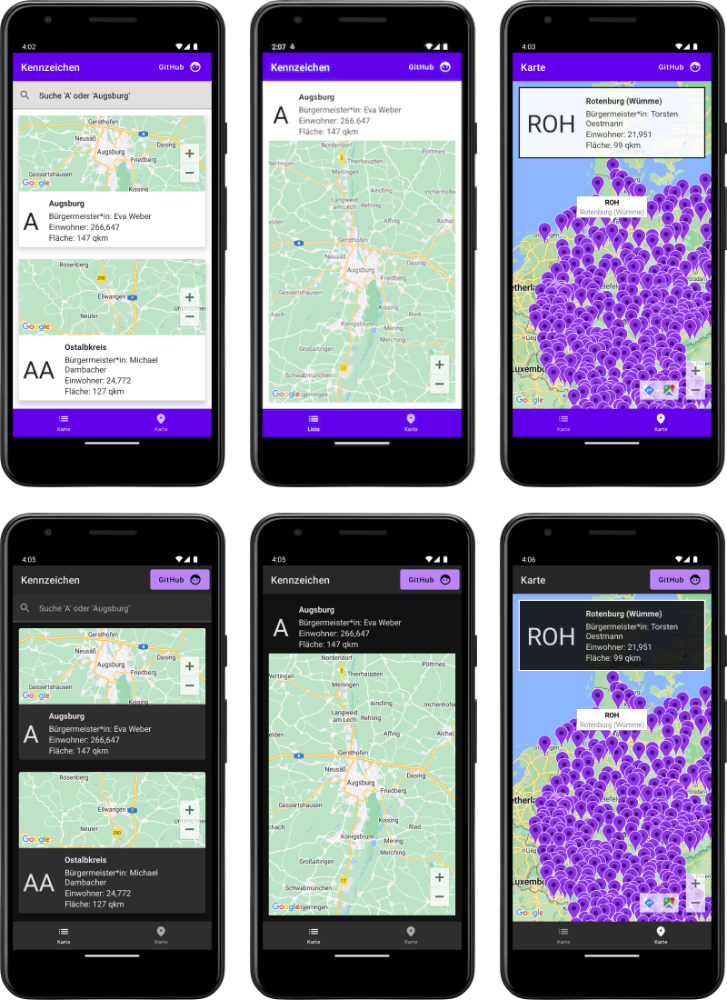
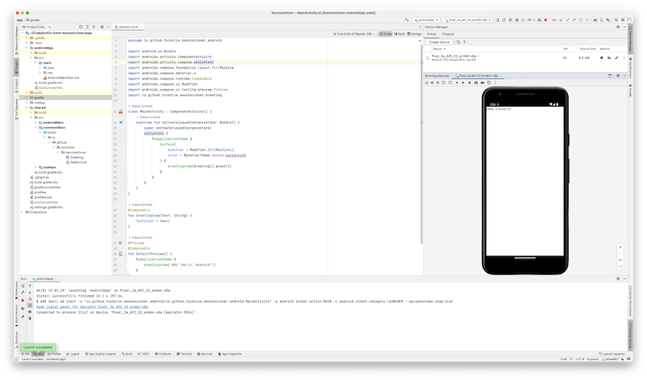

# kotlin-kmm-kennzeichner

## tl;dr
This is currently a playground to get to know with [Kotlin Mobile Multiplatform](https://kotlinlang.org/lp/mobile/) in combination with a shared Jetpack Compose and SwiftUI.

The app(s) will provide a look for for German license plate IDs such as "A" for Augsburg, "M" for Munich, etc. pp. The long time goal is to roll out this limited set of features to more KMM-able platforms such as desktop or the web.

## Build status

|Service|Status|
|-------|------|
|-|-|

## Publications

- Dr. Windows [Das Entwicklertagebuch Kennzeichner #1: Bing AI Chat als Datengrundlage](https://www.drwindows.de/news/entwicklertagebuch-kennzeichner-1-mit-bing-ai-chat-als-datengrundlage)
- Dr. Windows [Das Entwicklertagebuch Kennzeichner #2: Excel kann Geografie und mag kein Berlin](https://www.drwindows.de/news/das-entwicklertagebuch-kennzeichner-2-excel-kann-geografie-und-mag-kein-berlin)
- Dr. Windows [Das Entwicklertagebuch Kennzeichner #3: Shared Core – der Kern des Ganzen](https://www.drwindows.de/news/das-entwicklertagebuch-kennzeichner-3-shared-core-der-kern-des-ganzen)
- Dr. Windows [Das Entwicklertagebuch Kennzeichner #4: Jetzt wird’s mobil](https://www.drwindows.de/news/entwicklertagebuch-kennzeichner-4-jetzt-wirds-mobil)

## Requirements
### Android app
- Windows / Linux / macOS
- Android Studio with KMM plugin
- Google Maps App Key in `local.properties`

### iOS App
- macOS Ventura+
- Xcode Command line tools 13.4

## Versions

### 0.3.* (iOS MVP)
**Main features**
- MVP-ish finished iOS App with list, detail, map and filter features.
- Updated toolchain to Xcode 15 and iOS 17
- Updated Readme to cover how to run the project

**UI**

### 0.2.* (Android MVP)
**Main features**
- MVP-ish finished Android App with list, detail, map and filter features.
- Added future-proof dependencies like Koin
- Migrated from PoC to stable MVVM pattern
- Added documentation to Kotlin files

**UI**

### 0.1 (Project setup)
**Main features**

Successful run of the Android Studio Kotlin Mobile Multiplatform. Tested by starting the Android and iOS application.

**UI**

## Feature roadmap

### Setup
- [x] Project setup
- [x] Find data source of license plate ids

### Core functionality
- [x] List license plates id
- [x] Show detail of a license plate id

### UI
#### Android (Compose)
- [x] Create list view
- [x] Create detail view
- [x] Create map view with markers
- [x] Add searchbar to filter lists

#### iOS (SwiftUI)
- [x] Create list view
- [x] Create detail view
- [x] Create map view with markers
- [x] Add searchbar to filter lists

### Future feature ideas
- [ ] Add digital assistant support
- [ ] Add "fav" and "share" feature

### Instruments
- [ ] Check how's the memory consumption
- [ ] Check if there is no memory leakage

## Keep in mind
This app is purely build for having fun! All features have room for improvements or could be done more elegant. This app was and will be never meant to run in production-like environments. Learning is fun!

## Authors
Just me, [Tobi]([https://tscholze.github.io).

## Links
- [Dr. Windows](https://drwindows.de) news portal and community.
- [Kobweb Discord](https://discord.com/invite/5NZ2GKV5Cs) server where I met awesome Kotlin folks
- [KMM product page](https://kotlinlang.org/lp/mobile/) at kotlinlang.org

## Thanks to
The app is built on the work of giants. Without the following folks, repositories and posts, my tiny project would not exist.

- [David Herman (bitspittle)](https://github.com/bitspittle) - one of the most aspiring Kotlin educator and developer of [Kobweb](http://kobweb.varabyte.com)
- [Adrian Witaszak (adrianwitaszak)](https://github.com/adrianwitaszak) for bringing the joy of KMM into my life

## License
This project is licensed under the MIT License - see the [LICENSE](LICENSE) file for details.
Dependencies or assets maybe licensed differently.
